### **Parâmetros da rota GET /api/categories**

---

**Resumo:** retorna a lista de todas as categorias disponíveis no sistema. Utilizada principalmente para preencher menus de navegação e opções de filtros na interface (como a sidebar).

**Parâmetros da query string:**

- *Nenhum.* A rota não recebe parâmetros.

**Exemplo de request:**

```http
GET /api/categories HTTP/1.1
Content-Type: application/json
```

**Exemplo de chamada com `curl`:**

```bash
curl -X GET "http://localhost:3000/api/categories" \
  -H "Content-Type: application/json"
```

**Resposta de sucesso:**

- Código: `200 OK`

```json
{
  "success": true,
  "data": {
    "categories": [
      {
        "id": 1,
        "name": "Futebol",
        "slug": "futebol"
      },
      {
        "id": 2,
        "name": "Esportes",
        "slug": "esportes"
      },
      {
        "id": 3,
        "name": "Tecnologia",
        "slug": "tecnologia"
      }
    ]
  }
}
```

**Respostas de erro:**

- `400 Bad Request`: parâmetro de categoria inválido ou malformado

*(Nota: Se não houver categorias cadastradas, a rota retorna `200 OK` com uma lista vazia)*


### **Fluxograma da rota de categorias:**
---
**Resumo:** diagrama de fluxo da listagem de categorias para preenchimento da interface do utilizador.

