### **Parâmetros da rota `GET /api/news`**

---

**Resumo:** retorna notícias com suporte a filtros por categoria e pesquisa textual. Os resultados são consultados no cache quando disponíveis e, em caso de ausência, obtidos do banco de dados. Após a verificação dos resultados, as notícias encontradas passam pelo algoritmo de personalização e reordenação (*personalization + re-ranking*).

**Parâmetros da query string:**

- `category` (opcional): `string` — filtra as notícias por categoria.
- `query` (opcional): `string` — pesquisa notícias por texto.

Os parâmetros `category` e `query` podem ser utilizados individualmente para filtrar notícias por categoria ou pesquisar conteúdos textuais. Quando nenhum deles é informado, a rota retorna o feed de notícias.

**Exemplos de request:**

```http
GET /api/news HTTP/1.1
```

```http
GET /api/news?category=technology HTTP/1.1
```

```http
GET /api/news?query=artificial%20intelligence HTTP/1.1
```

**Exemplos de chamada com `curl`:**

```bash
curl "http://localhost:3000/api/news"
```

```bash
curl "http://localhost:3000/api/news?category=technology"
```

```bash
curl "http://localhost:3000/api/news?query=artificial%20intelligence"
```

**Resposta de sucesso:**

- Código: `200 OK`

```json
{
  "success": true,
  "data": {
    "news": [
      {
        "id": 1,
        "title": "Example news title",
        "category": "technology"
      }
    ]
  }
}
```

**Respostas de erro:**

- `400 Bad Request`: parâmetros inválidos ou malformados.

Uma consulta válida sem resultados retorna `200 OK` com uma lista vazia.

---

### **Parâmetros da rota `GET /api/news/:id`**

---

**Resumo:** retorna os detalhes de uma notícia específica, identificada pelo seu ID. A consulta utiliza o cache quando disponível e recorre ao banco de dados quando necessário. A visualização do artigo pode gerar um evento de interação para atualizar o perfil de preferências do usuário, influenciando futuras recomendações.

**Parâmetros da rota:**

- `id` (obrigatório): identificador da notícia.

**Exemplo de request:**

```http
GET /api/news/1 HTTP/1.1
```

**Exemplo de chamada com `curl`:**

```bash
curl "http://localhost:3000/api/news/1"
```

**Resposta de sucesso:**

- Código: `200 OK`

```json
{
  "success": true,
  "data": {
    "article": {
      "id": 1,
      "title": "Example news title",
      "category": "technology"
    }
  }
}
```

**Respostas de erro:**

- `400 Bad Request`: ID inválido ou malformado.
- `404 Not Found`: notícia inexistente.

---

### **Parâmetros da rota `GET /api/news/:id/related`**

---

**Resumo:** retorna notícias relacionadas a um artigo específico, identificado pelo seu ID. Os resultados são consultados no cache quando disponíveis e, caso contrário, obtidos do banco de dados.

**Parâmetros da rota:**

- `id` (obrigatório): identificador da notícia de referência.

**Exemplo de request:**

```http
GET /api/news/1/related HTTP/1.1
```

**Exemplo de chamada com `curl`:**

```bash
curl "http://localhost:3000/api/news/1/related"
```

**Resposta de sucesso:**

- Código: `200 OK`

```json
{
  "success": true,
  "data": {
    "news": [
      {
        "id": 2,
        "title": "Related news title",
        "category": "technology"
      }
    ]
  }
}
```

**Respostas de erro:**

- `400 Bad Request`: ID inválido ou malformado.
- `404 Not Found`: artigo de referência inexistente.

Se o artigo de referência existir, mas nenhuma notícia relacionada for encontrada, a API retorna `200 OK` com uma lista vazia.

---

### **Fluxograma das rotas `api/news`**

---

**Resumo:** diagrama de fluxo das rotas de notícias, incluindo validação inicial da requisição, consulta ao cache, acesso ao banco de dados em caso de ausência no cache, verificação dos resultados, personalização e reordenação do feed, tratamento de erros e registro de interações para atualizar as preferências do usuário.

 