### **Parâmetros da rota POST /api/user/register**

---

**Resumo:** cria uma nova conta de usuário.


**Parâmetros do corpo da requisição:**

- `name` (obrigatório): string

- `email` (obrigatório): string

- `password` (obrigatório): string


**Exemplo de request:**

```http
POST /api/user/register HTTP/1.1
Content-Type: application/json
```


```json
{

  "name": "User test",

  "email": "user_test@test.com",

  "password": "Test_123456"

}

```


**Resposta de sucesso:**

- Código: `201 Created`


```json

{

  "success": true,

  "data": {

    "user": {

      "id": 2,

      "name": "User Test",

      "email": "user_test@test.com",

      "avatar": null

    },

    "token": "jwt-token"

  }

}

```


**Respostas de erro:**

- `400 Bad Request`: campos inválidos ou ausentes

- `409 Conflict`: e-mail já cadastrado


### **Fluxograma da rota `api/auth/register`:**
---
**Resumo:** diagrama de fluxo da rota register



